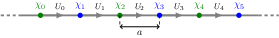

# Lattices

Any calculation in `Schwinger.jl` will start with a `SchwingerLattice`. The number of sites `N` and number of flavors `F` are type parameters. Other parameters can be specified as keyword arguments:

- `periodic`: whether the lattice is periodic
- `q`: the integer charge of the fermions
- `θ2π`: the ``\theta``-angle (divided by ``2\pi``)
- `a`: the lattice spacing (in coupling units)
- `m`: the physical mass (in coupling units); the [mass shift](https://arxiv.org/pdf/2206.05308) is applied automatically
- `mlat`: the mass parameter in the Hamiltonian
- `mprime`: the coefficient of the hopping-type mass term

The sites of the lattice are indexed from `1` to `N`. The electric field operators are laid out as in the diagram below.



Here ``\alpha = 1,\ldots,F`` is a flavor index.

For details of how these parameters enter into the Hamiltonian, see [here](hamiltonian.md).

```@docs
SchwingerLattice
```