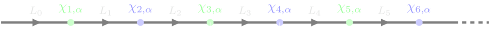

# Lattices

Any calculation in `Schwinger.jl` will start with a `Lattice`. The only required parameter is the number of sites `N`. For any backend, `N` can be an even integer; for `MPSKit`, it can also be `Inf`. Other parameters can be specified as keyword arguments:

- `F`: number of flavors (default `1`)
- `periodic`: whether the lattice is periodic (default `false`)
- `q`: the integer charge of the fermions (default `1`)
- `θ2π`: the ``\theta``-angle divided by ``2\pi`` (default `0`)
- `a`: the lattice spacing in coupling units (default `1`)
- `m`: the physical mass (in coupling units); the [mass shift](https://arxiv.org/pdf/2206.05308) is applied automatically. (default `0`)
- `mlat`: the mass parameter in the Hamiltonian (default `-q^2 * F * a/8`)
- `mprime`: the coefficient of the hopping-type mass term (default `0`)

The sites of the lattice are indexed from `1` to `N`. The electric field operators are laid out as in the diagram below.



Here ``\alpha = 1,\ldots,F`` is a flavor index.

For details of how these parameters enter into the Hamiltonian, see [here](hamiltonian.md).

```@docs
Lattice
```